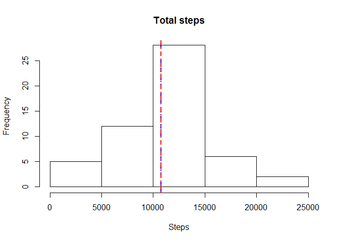
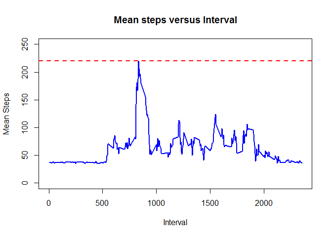
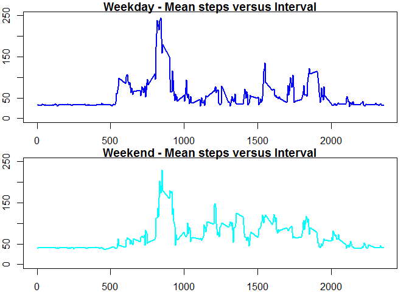

# Reproducible Research: Peer Assessment 1
# Developed by : Tinniam V Ganesh


```r
library(dplyr)
```

```
## 
## Attaching package: 'dplyr'
## 
## The following object is masked from 'package:stats':
## 
##     filter
## 
## The following objects are masked from 'package:base':
## 
##     intersect, setdiff, setequal, union
```

```r
library(lubridate)
```

```
## Warning: package 'lubridate' was built under R version 3.1.3
```
## Loading and preprocessing the data

```r
setwd("C:\\software\\R\\coursera\\reproducible-research\\peer-assignment-1\\git-in\\RepData_PeerAssessment1")
```
# Specify the extract folder
# The file is extracted into the current folder

```r
unzip("./activity.zip",  exdir = ".")
a <- read.csv("activity.csv")
activity <- read.csv("activity.csv",
                     colClasses=c("numeric","POSIXct","numeric"))
b <- !is.na(activity$steps)
c <- activity[b,]
```

## What is mean total number of steps taken per day?


```r
d <-tbl_df(c)
```

# Generate the total steps based on date

```r
e <- summarise(group_by(d,date),total_steps = sum(steps))
```

# Create a histogram of the total steps taken
1. Draw the mean (red)
2. Draw the median (blue

```r
hist(e$total_steps,main="Total steps",xlab="Steps",ylab="Frequency")
abline(v=mean(e$total_steps),col="blue",lwd=2.0,lty=2)
abline(v=median(e$total_steps),col="red",lwd=2.0,lty=4)
```

 


## Inputing missing values
# The following strategy is taken for inputting missing values

1. Group by date and calculate the average steps for these date values
2. Substitute these average values where the values are missing

```r
avg <- summarise(group_by(d,date),mean_steps = mean(steps))
```

# Substitute average steps where the value is 0

```r
for(i in 1:length(avg$date)) {
    val <- avg$mean_steps[i]
    # Find values that are missing
    v <- d$date==avg$date[i] & d$steps==0
    # Substitute the average value where missing
    d[v,]$steps <- val
}
```

## What is the average daily activity pattern

```r
interval <- seq(from=0,to=2355,by=5)
```

# Group by the sequence of intervals and calculate the mean over days in the 
# interval

```r
for(i in seq_along(interval)) {
  averageSteps <- summarise(group_by(d,interval), m = mean(steps))
   
}
```
# Plot the average steps for each interval over all days
# Compute the maximum and plot the line

```r
plot(averageSteps$interval,averageSteps$m,type="l",xlab="Interval",
                ylab="Mean Steps", main="Mean steps versus Interval",col="blue",
                ylim=c(0,250), lwd=2.0)
abline(h=max(averageSteps$m),col="red",lty=2,lwd=2)
```

 


`

## Are there differences in activity patterns between weekdays and weekends?

# Use the wday function from the package 'mutate' and get the days

```r
d1 <- mutate(d,day=wday(date,label=TRUE))
```

# Identify weekdays **'m'** and weekend **'!m'**

```r
m <- d1$day >"Mon" & d1$day < "Fri"
```
# Create  dataframes for weekdays and weekends


```r
weekday <- d1[m,]
weekend <- d1[!m,]
```
# Calculate the mean steps for weekday


```r
for(i in seq_along(interval)) {
  wday <- summarise(group_by(weekday,interval), m = mean(steps)) 
}
```

1. Create a panel of plots
2. Calculate the mean steps for weekdays
3. Plot for weekdays
4. Calculate the mean steps for weekends
5. Plot for weekends

```r
par(mfrow=c(2,1))
par(mar=c(2,2,1,1))
for(i in seq_along(interval)) {
  wday <- summarise(group_by(weekday,interval), m = mean(steps))
  
}
plot(wday$interval,wday$m,type="l",xlab="Interval",
     ylab="Mean Steps", main="Weekday - Mean steps versus Interval",col="blue",
     ylim=c(0,250), lwd=2.0)

for(i in seq_along(interval)) {
  wend <- summarise(group_by(weekend,interval), m = mean(steps))
  
}
plot(wend$interval,wend$m,type="l",xlab="Interval",
     ylab="Mean Steps", main="Weekend - Mean steps versus Interval",col="cyan",
     ylim=c(0,250), lwd=2.0)
```

 
